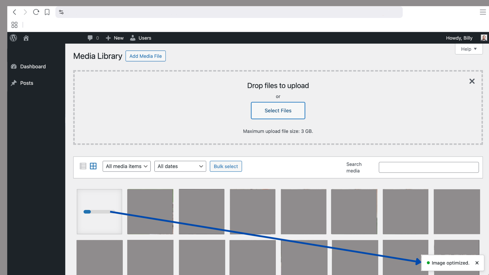
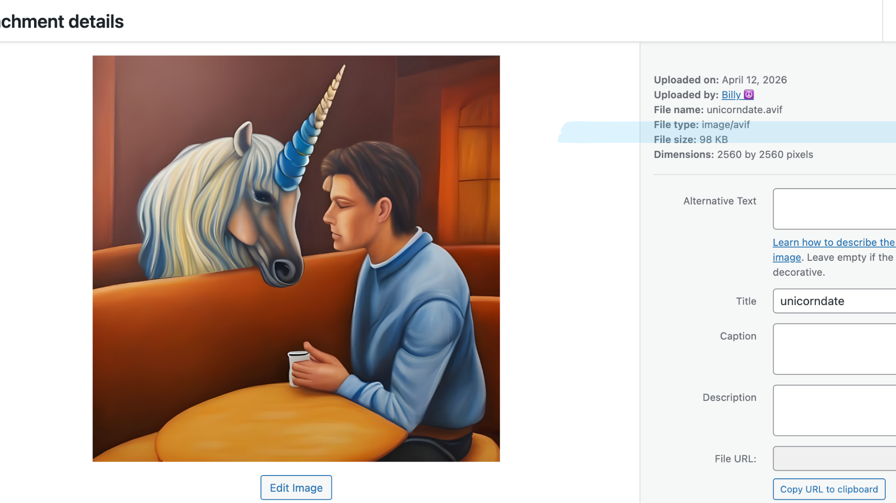

# Menagerie

**Contributors:** zerosonesfun (Billy Wilcosky)
**Tags:** images, optimization, performance, upload, webp, avif  
**Requires WordPress:** 6.9+  
**Tested up to:** 7.0  
**Requires PHP:** 8.0+  
**Stable tag:** 1.0.0  
**License:** [GPL-2.0-or-later](https://www.gnu.org/licenses/gpl-2.0.html)

Client-side image optimization in the browser before upload. Safe fallbacks keep uploads working when optimization cannot run.

**Download size and visitors:** Prefer no extra browser weight? Use **Server-side only** (and optional server-side fallback) in **Settings → Menagerie**. If you keep client-side optimization with **Advanced encoders (WebAssembly)** on, sticking to **WebP** typically adds on the order of **~0.2–0.5 MB** to what the browser downloads for the codec path (plus a small main script). **AVIF** can require larger codec data—**up to ~3.5 MB** for the encoder in a worst case—but that loads **only when someone uploads an image** and the pipeline reaches AVIF; the browser **caches** it, so it is not a full repeat download every time. The optimizer runs **only on pages where uploads are enabled** (per your settings), not on every page view for every visitor. Client-side optimization is **not** a heavy download for casual browsing.

## Description

Menagerie by [Billy Wilcosky](https://wilcosky.com) resizes and re-encodes images in the visitor’s browser before they reach your server. If anything fails—browser limits, timeouts, or unsupported formats—the original file is uploaded unchanged.

- No external services or APIs
- AVIF / WebP / JPEG strategies with automatic fallbacks
- Transparency-aware encoding
- EXIF orientation handled via modern decode APIs where supported
- Toast status messages (accessible, with reduced-motion support)
- Optional detection of other image optimization plugins to reduce double compression
- Attachment meta records when Menagerie optimized a file (original size, optimized size, output MIME type)—filenames are not used for tracking

## Installation

1. Upload the `menagerie` folder to `/wp-content/plugins/`
2. Activate **Menagerie** in **Plugins**
3. Open **Settings → Menagerie** to configure options

## Building from source / releases

- For **Advanced encoders (WebAssembly)** to run, the Vite build must be present: `assets/js/dist/menagerie-optimizer.js` plus the generated `assets/` chunks beside it. From the plugin directory run `npm install` then `npm run build`, and commit `assets/js/dist/` with your release.
- The browser only receives `wasmEncoders: true` when that bundle exists; otherwise the classic script path is used and behavior matches “WASM off.” If you enable the setting without running the build, a **Settings** notice explains that `dist/` is missing.
- **Bulk uploads**: WASM encodes are **serialized** on one worker queue so overlapping jobs cannot corrupt output; together with the existing sequential optimization queue, many-file batches are handled safely.
- Do not distribute `node_modules` to end users.

## Frequently asked questions

### Will this break my uploads?

No. Optimization is an optional enhancement. If processing fails, the plugin uses the original file.

### Why do I see a warning about other optimization plugins?

Running Menagerie together with server-side optimizers (Smush, ShortPixel, EWWW, etc.) can compress images twice. Consider disabling overlapping features in one of the plugins.

### My file keeps its original extension but the bytes are WebP or JPEG. Is that OK?

WordPress and PHP typically rely on MIME detection during upload. Menagerie does not rename files by design.

### How does quality compare to other optimizers?

Default quality (85) is in the same range many hosting and SaaS tools use for “lossy” web delivery (often roughly 80–90). You can raise or lower it in **Settings → Menagerie**. Downscaling uses the browser’s high-quality image smoothing when resizing.

### Are GIFs optimized?

Animated GIFs are left unchanged so frames are not collapsed to a single image. Static GIFs are also skipped for the same reason; upload as PNG or JPEG if you need smaller files.

### Will colors look exactly like my original?

The browser encodes to sRGB via canvas, similar to other client-side tools. Very wide-gamut or HDR sources may look slightly different on some displays—that is normal for web-safe output.

### What does “Advanced encoders (WebAssembly)” do?

Optional MozJPEG, WebP, and AVIF encoders run in the browser (via the [jSquash](https://github.com/jamsinclair/jSquash) libraries) and often produce smaller or higher-quality files than the browser’s built-in canvas encoder at the same quality setting. The first encode may download codec data; large AVIF codecs load only when AVIF output is attempted. If anything fails, Menagerie falls back to the built-in encoder.

### How hard does Menagerie try to output AVIF and WebP?

With Advanced encoders on, Menagerie gives **both** codecs the same strategy: several WASM attempts with short delays (cold WebAssembly load), faster encoder options where the libraries allow (AVIF speed, WebP method/pass), prewarming **both** codecs in the worker after page load, then the browser’s native `canvas` encoder with a **quality ladder** (and type-only) before moving to the next format in the chain. JPEG/MozJPEG in WASM does not use the same multi-retry ladder because the canvas JPEG path is cheap and reliable.

WASM is only activated when the built bundle exists under `assets/js/dist/`—see **Building from source / releases**. See `THIRD-PARTY-LICENSES.md` for codec licenses.

### Do bulk or multi-file uploads work?

Yes. Work is queued so large batches stay predictable, and WASM encodes run one-at-a-time on the worker queue to avoid races during bulk or rapid uploads.

### Can the server optimize an image that was already optimized in the browser?

Usually no: when the browser succeeds, Menagerie sends `menagerie_meta` and the attachment is marked so server-side fallback skips it. In rare cases—network loss, REST quirks, or a failed nonce—that meta never arrives, `_menagerie_processed` is not set, and **server-side fallback may encode the file again**. That is uncommon; if you see double work, check connectivity and that uploads complete normally.

### Server-side fallback: performance and timeouts

Server-side optimization runs **during the upload request** (decode, resize, encode, regenerate thumbnails). Very large originals on low PHP `max_execution_time` or memory limits can still fail or time out; raising limits or uploading smaller sources helps. Async or background processing is not implemented yet.

### Does server-side fallback prefer AVIF?

In **Auto** format mode, yes—the server uses the same order as the browser (AVIF, then WebP, then JPEG or PNG). You only get AVIF if PHP can encode it (GD with AVIF or ImageMagick with libavif); you only get WebP if GD or Imagick reports WebP support—as shown under **Tools → Site Health → Info → Media handling**. Menagerie attempts **AVIF and WebP each twice** before falling through to the next format. If the host cannot encode a format, the chain continues automatically—there is no separate “AVIF-only” or “WebP-only” server mode beyond choosing **Output format** and a capable server.

### Why would server-side optimization do nothing when both “Process uploads” options are off?

**Settings → Menagerie** requires **at least one** of “Process uploads in the admin” or “Process uploads on the front end” for any Menagerie processing—including server-side fallback. If both are unchecked, nothing runs; enable the context you use.

### Why might the same image become AVIF in the admin but WebP on the front end?

On the **front end**, file inputs are optimized once when you pick a file, then the upload runs again through the same pipeline. The second pass skips work when the file is already small and “Convert when useful” applies—so the first successful format (AVIF, WebP, or JPEG in order) tends to stick. The **admin** Media Library usually runs a single optimization pass on the original file. Menagerie also prewarms encoders after load so the first upload is closer to later ones. None of this changes settings between contexts; it is timing and pass count.

## Screenshots

### 1. Media Library — uploading an image; success toast at the bottom right

### 2. Attachment details — optimized file shows **AVIF** type and a small file size

## Changelog

### 1.0.0

- Initial release.
- Skip a second browser encode at upload time when the file was already optimized (e.g. front-end file picker + XHR), improving parity with admin uploads and reducing duplicate work.
- Idle-time encoder prewarm (native probes; WASM AVIF touch when Advanced encoders are on).

## Upgrade notice

**1.0.0** — Initial release.
